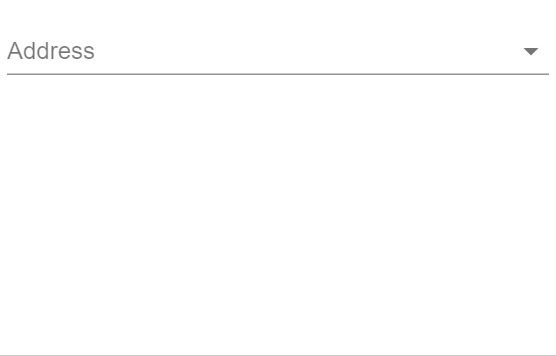

# material-ui-address-input

[](https://travis-ci.org/DanielArthurUK/material-ui-address-input)
[](https://www.npmjs.com/package/material-ui-address-input)
[](https://standardjs.com)

This component is an address picker component for [Material-UI](http://www.material-ui.com). 



## Installation

`npm install --save material-ui-address-input`

> **Note:** material-ui-address-input only supports Material-UI 1.0.0 or later. There is not planned support for Material-UI 0.x. If you are using an earlier version of Material-UI, you should consider upgrading to v1.

## Usage

The component only supports [controlled input](https://reactjs.org/docs/forms.html#controlled-components) at the moment.

```jsx
import React, {Component} from 'react'
import AddressInput from 'material-ui-address-input'

class ControlledAddressInput extends Component {
    constructor (props) {
        super(props)
        this.state = {
            address: '',
            addresses: []
        }
    }

    handleAddAddress = address => {
        this.setState({
            addresses: [...this.state.addresses, address]
        })
    }

    handleChangeAddress = addressIndex => {
        this.setState({
            address: addressIndex
        })
    }

    render () {
        return (
            <AddressInput
                onAdd={this.handleAddAddress}
                onChange={this.handleChangeAddress}
                value={this.state.address}
                allAddresses={this.state.addresses}
            />
        )
    }
}

export default ControlledAddressInput
```

## Props
| Name | Type | Default | Description |
| --- | --- | --- | --- |
| `addressLabels` | `shape` | `{ houseNameNumber: 'House Name/Number', addressLine1: 'Address Line 1', addressLine2: 'Address Line 2', city: 'City', region: 'State/Province/Region', zip: 'ZIP/Postal Code', country: 'Country' }` | Custom labels to display when the user creates a new address. Note that if you wish to use custom labels you must specify each of the labels. |
| `addressResolver` | `func` | | If specified, the component will offer the user a choice to find their address automatically given their house name/number and zip/postal code (and their country if `displayCountry` is set to `true`). When the user types in this information and clicks 'Find Address', this function will be called. This function should add the resolved address and change the value of this component to correctly input the new address. Signature: `function(houseNameNumber: string, zip: string, country: string) => void` |
| `allAddresses`* | `array` | | Array containing all of the `address` objects that the user can choose from. Addresses should be of the form {addressLine1: string, addressLine2: string, city: string, region: string, zip: string, country: string} |
| `disabled` | `bool` | `false` | If `true`, the label, input and helper text should be displayed in a disabled state. |
| `displayCountry` | `bool` | `true` | Whether the address selector should allow users to choose their country. Often disabled if your application typically has users from a single country. |
| `error` | `bool` | | If `true` the address dropdown will be in an error state and appear red. |
| `helperText` | `node` | | The helper text content |
| `id` | `string` | `'address'` | The `id` to be passed to the select element. |
| `label` | `string` | `'Address'` | The label to be shown on the address picker component. |
| `margin` | `enum: 'none' | 'dense' | 'normal'` | `'none'` | If `dense` or `normal`, will adjust vertical spacing of this component. |
| `name` | `string` | `'address'` | The `name` to be passed to the select element. |
| `native` | `bool` | `false` | If `true`, a native `<select>` element will be rendered. |
| `onAdd`* | `func` | | Callback that is fired when the user adds a new address. This function should add the new address to the `allAddresses` prop. The function is called with a single parameter `address` with the following shape: `address: {addressLine1: string, addressLine2: string, city: string, region: string, zip: string, country: string}` |
| `onChange`* | `func` | | Callback that is fired when the user changes the active address using the dropdown box. There is a single parameter `addressIndex` which represents the index in the array of all addresses that the selected address represents. |
| `required` | `bool` | `false` | If `true`, the label will indicate that the user must select an address from this component. Note that HTML5 validations for this feature only work with `native` set to `true`. |
| `value`*| `union: string | number` | | The index of the selected address in the array of all addresses. If you desire 'no address selected', then `value` should be the empty string `''`. |

## Contributing
PRs are welcome! :tada:
